# System Overview

Waffle is built as a distributed microservices architecture designed for scalability, reliability, and maintainability. This document provides a high-level overview of the system components and their interactions.

## Architecture Diagram

```mermaid
graph TB
    User[👤 User] --> Web[🌐 Web Frontend]
    Web --> Engine[⚙️ Engine API]
    Web --> Scraper[🤖 Scraper Service]
    
    Engine --> MongoDB[(🗄️ MongoDB)]
    Engine --> Blockchain[⛓️ Smart Contracts]
    Engine --> AI[🧠 AI Analyzer]
    
    Scraper --> SQLite[(📁 SQLite DB)]
    Scraper --> Twitter[🐦 Twitter API]
    
    AI --> HuggingFace[🤗 Hugging Face]
    
    Blockchain --> Ethereum[💎 Ethereum]
    
    subgraph "Frontend Layer"
        Web
    end
    
    subgraph "Application Layer"
        Engine
        Scraper
        AI
    end
    
    subgraph "Data Layer"
        MongoDB
        SQLite
        Blockchain
    end
    
    subgraph "External Services"
        Twitter
        HuggingFace
        Ethereum
    end
```

## Core Components

### 1. Web Frontend (`/web`)

**Technology**: React Router 7, TypeScript, TailwindCSS

The user-facing application that provides:

- **User Interface**: Modern, responsive design with smooth animations
- **Wallet Integration**: Multi-wallet support (RainbowKit, Xellar)
- **Authentication**: Twitter OAuth and Web3 wallet authentication
- **Real-time Updates**: Live data synchronization
- **Profile Management**: User profiles for both wallet addresses and Twitter users

**Key Features**:

- Server-side rendering for fast initial loads
- Progressive Web App capabilities
- Advanced animations with GSAP and Framer Motion
- Responsive design for all device types

### 2. Engine API (`/engine`)

**Technology**: Express.js, MongoDB, TypeScript

The core backend service that handles:

- **API Endpoints**: RESTful API for all platform features
- **Authentication**: JWT-based auth with wallet signature verification
- **Business Logic**: Core platform functionality
- **Database Operations**: User data, reviews, badges, reputation
- **Blockchain Integration**: Smart contract interactions

**Key Features**:

- Modular service architecture
- WebSocket support for real-time features
- Comprehensive API documentation
- Secure authentication and authorization

### 3. Scraper Service (`/scraper`)

**Technology**: Bun, Hono, SQLite, Drizzle ORM

Dedicated service for external data collection:

- **Twitter Scraping**: Automated Twitter profile data collection
- **Data Caching**: Efficient caching of scraped data
- **Rate Limiting**: Respectful API usage
- **Data Validation**: Clean, validated data output

**Key Features**:

- High-performance Bun runtime
- SQLite for fast local data storage
- Type-safe database queries with Drizzle
- Configurable scraping intervals

### 4. AI Analyzer (`/ai`)

**Technology**: Python, Hugging Face, Gradio

Machine learning service for content analysis:

- **Review Analysis**: Sentiment analysis and quality scoring
- **Content Moderation**: Automatic detection of inappropriate content
- **Reputation Scoring**: AI-assisted reputation calculations
- **Trend Analysis**: Insights into platform usage patterns

**Key Features**:

- Pre-trained transformer models
- Real-time analysis capabilities
- Scalable ML pipeline
- Integration with main API

### 5. Smart Contracts (`/contracts`)

**Technology**: Solidity, Foundry, OpenZeppelin

On-chain components for decentralized features:

- **Reputation Storage**: Immutable reputation records
- **Badge System**: On-chain badge issuance and verification
- **Governance**: Decentralized decision-making mechanisms
- **Token Economics**: Incentive mechanisms

**Key Features**:

- Gas-optimized contract design
- Comprehensive test coverage
- Upgradeable contract patterns
- Security-first approach

## Data Flow

### 1. User Registration Flow

### 2. Review Submission Flow

### 3. Profile Viewing Flow

## Scalability Considerations

### Horizontal Scaling

- **Frontend**: CDN distribution and edge caching
- **API**: Load balancer with multiple Engine instances
- **Database**: MongoDB sharding and read replicas
- **Scraper**: Multiple worker instances with job queue

### Performance Optimization

- **Caching**: Redis for session and frequent data
- **Database Indexing**: Optimized queries and indexes
- **Asset Optimization**: Image compression and lazy loading
- **Code Splitting**: Dynamic imports for reduced bundle size

### Security Measures

- **Input Validation**: Comprehensive request validation
- **Rate Limiting**: API endpoint protection
- **Authentication**: Multi-layer auth verification
- **Data Encryption**: Sensitive data protection

## Monitoring & Observability

### Logging

- **Structured Logging**: JSON-formatted logs across all services
- **Centralized Collection**: Aggregated logging system
- **Log Levels**: Appropriate logging levels for different environments

### Metrics

- **Application Metrics**: Performance and usage statistics
- **Infrastructure Metrics**: Server health and resource usage
- **Custom Metrics**: Business-specific KPIs

### Health Checks

- **Service Health**: Endpoint health monitoring
- **Database Health**: Connection and query performance
- **External Dependencies**: Third-party service availability

## Deployment Architecture

### Development Environment

- **Local Development**: Docker Compose for full stack
- **Hot Reloading**: Fast development feedback loops
- **Test Databases**: Isolated test data

### Production Environment

- **Container Orchestration**: Kubernetes or Docker Swarm
- **Service Mesh**: Inter-service communication
- **Auto-scaling**: Dynamic resource allocation
- **Backup Systems**: Automated data backup and recovery

---

This architecture provides a solid foundation for Waffle's growth while maintaining flexibility for future enhancements and scaling requirements.
